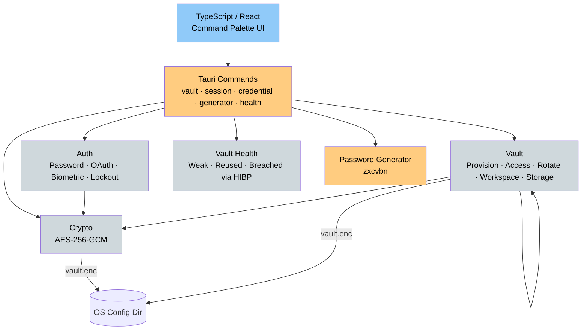

# Latch Password Manager

A local password manager with a compact Raycast-style interface, being rebuilt in Rust and GPUI for Windows, macOS, and Linux.

The GPUI rebuild is in progress. `crates/latch-core` now contains the shared vault logic;
`crates/latch-desktop` implements the native application. The temporary Tauri host keeps legacy
Google access for migration, while the native dependency graph excludes it. The native
application supports password setup/unlock, credential search/add/edit/delete, timed reveal,
copy, TOTP, password generation, email aliases, health checks, auth rotation, and editor-settings
color import. Tray, global shortcut, and signed updater integration are implemented; actual
platform, signing, installer, and upgrade acceptance remain open. See [the implementation plan](docs/plans/gpui-rebuild.md).

## Temporary migration-host architecture



## Features

- **Native access**: Master password; Windows Hello/macOS Keychain device keys on supported devices. Google access exists only in the temporary migration host.
- **Command Palette UI**: Raycast-style single-window interface with keyboard navigation
- **Password Generator**: Configurable passwords with zxcvbn strength analysis
- **Vault Health Dashboard**: Detects weak, reused, and breached credentials via HIBP k-anonymity API
- **Session Management**: 30-minute auto-lock with clipboard auto-clear
- **Vault Migration**: Re-encrypt between auth methods without losing credentials
- **Lockout Protection**: Exponential backoff on failed auth attempts (5s → 5min max)
- **Zero-Knowledge**: Master password never stored, session key in memory only
- **Cross-Platform**: Windows, macOS, Linux — identical vault file format
- **Appearance**: Import explicit VS Code/Zed settings.json color overrides, preview/apply, edit, reload, and reset; no native theme presets.
- **Updates**: Native signed updater uses a separate feed; review packages are not published to the legacy feed.

## Prerequisites

- **Bun** (only for the temporary migration frontend)
- **Rust + Cargo** (stable, with `rustfmt` and `clippy`)
- **GPUI/platform dependencies**: Linux packages are listed in `.github/workflows/ci.yml`; migration-host prerequisites remain in [Tauri docs](https://v2.tauri.app/start/prerequisites/).

## Development

For a user-run native development launch, run `cargo run -p latch-desktop` from the repository root. This recompiles the changed source; launching an older `target/debug/latch-desktop.exe` will show its old UI. Close the migration host first: both current hosts take an exclusive vault lock.

PR CI also uploads `gpui-preview-<OS>-<architecture>` artifacts containing the new release-mode executable. Download the artifact matching your platform from its completed CI run, extract it, and launch `latch-desktop.exe` on Windows or `latch-desktop` on macOS/Linux. These previews use the existing vault location and are not signed installers. Windows debug binaries refer to shader files in the machine's Cargo registry and must be launched on their build machine; portable previews therefore use release mode, which embeds the shaders.

On macOS/Linux, restore the artifact's executable permission with `chmod +x latch-desktop` before launching. Linux closes by quitting; tray creation alone cannot establish that a desktop exposes the icon. Windows/macOS close to the tray with a locked vault when tray initialization succeeds.

The Native GPUI packages workflow also uploads `native-<OS>-<architecture>` installer artifacts when packaging changes. These include Windows NSIS, macOS app/DMG, and Linux deb/AppImage. The deb targets Ubuntu 24.04; AppImage needs the host's Wayland and GPU drivers. Signing and installed-app upgrade acceptance remain release gates.

Agents must follow the repository's no-local-build policy and use check/test commands. A user-run launch and CI-produced packages supply the native runtime checks.

The migration frontend uses `frontend` and `bun run tauri dev`. Existing Google vaults must unlock there and use Settings → Switch to master password before opening native Latch.

## Building

Builds and releases are handled by GitHub Actions CI. See `.github/workflows/release.yml`.

## Project Structure

```
frontend/          # Tauri v2 + React + TypeScript (api/, components/, hooks/, utils/)
frontend/src-tauri/ # Temporary Tauri host and command wrappers
crates/latch-core/  # Shared auth, crypto, vault, generator, and health code
crates/latch-desktop/ # Native GPUI host, without the styled component/theme layer
Cargo.lock         # Shared application lockfile
docs/adr/          # Architecture Decision Records
```

## Security

### Encryption & Key Derivation
- **Password Auth**: PBKDF2-HMAC-SHA256, 100,000 iterations
- **Historical compatibility**: Native reads the original password Argon2id format; legacy OAuth readers remain confined to the migration bridge.
- **Encryption**: AES-256-GCM with random 12-byte nonce
- **KDF-per-AuthMethod**: Each auth method uses a tailored KDF (see ADR-0002)

### Session Management
- Vault auto-locks after 30 minutes of inactivity
- Session key (`Zeroizing`) stored in memory only — cleared on lock
- Clipboard auto-clears 30 seconds after copy

### Important Notes
- **No Password Recovery**: Forgotten master password = lost data (by design)
- **Cross-Platform**: Vault file format identical across all platforms

## Troubleshooting

- **Vault not opening?** Check you're using the correct auth method and credentials.
- **Frontend not building?** Ensure you have the project Bun version installed.
- **Tauri build failing?** Check missing system dependencies (e.g. `libwebkit2gtk-4.0-dev` on Linux).

## Contributing

Contributions are welcome! See [CONTRIBUTING.md](CONTRIBUTING.md) and [AGENTS.md](AGENTS.md) for development guidelines.

Before opening a PR, run the CI checks locally:
```bash
# Backend
cd frontend/src-tauri && cargo fmt --all && cargo check && cargo clippy --all-targets --all-features -- -D warnings && cargo test

# Frontend
cd frontend && bun run typecheck
```

From the repository root, also run native checks:

```bash
cargo fmt --all -- --check
cargo check -p latch-desktop --all-targets --locked
cargo test -p latch-core --locked
cargo test -p latch-core --features legacy-oauth --locked
cargo test -p latch-desktop --locked
cargo clippy -p latch-core -p latch-desktop --all-targets --locked -- -D warnings
```

Local builds remain prohibited by `AGENTS.md`. Native launch, GPU, accessibility,
and installer validation require CI-produced artifacts and real platform checks.

## Acknowledgments

- Native UI built with [GPUI Kit](https://gpui.rs); temporary migration host uses Tauri and React
- Cryptographic functions powered by `aes-gcm`, `argon2`, and `pbkdf2`
- Password strength via `zxcvbn`
- Breach checking via [Have I Been Pwned](https://haveibeenpwned.com) k-anonymity API

## License

MIT — see [LICENSE](LICENSE).
