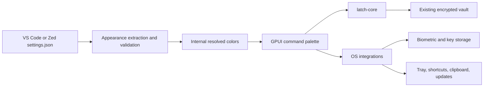
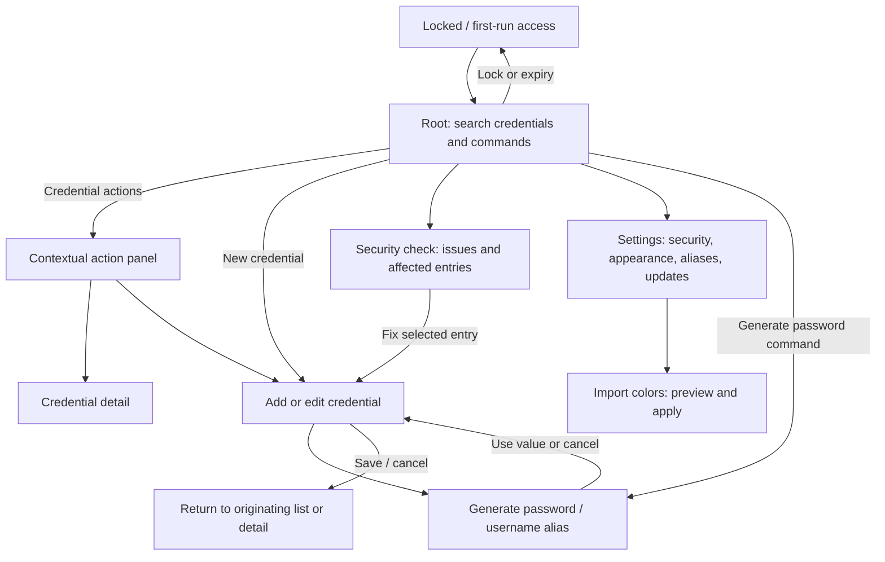

# Latch GPUI rebuild, Raycast-style UX overhaul, and editor-settings theme import

Research date: 2026-10-03. Repository baseline: `86129b8`, Latch 0.2.6.
Status: implementation started on `refactor/gpui-rebuild`. The research baseline below describes the original app; the native release gates remain open.

## Implementation progress

The native source now implements a functional compact application on `refactor/gpui-rebuild`: setup/unlock, fuzzy search, keyboard Actions, credential add/edit/delete with draft confirmation, detail/copy/timed reveal, TOTP, contextual password generation, SimpleLogin/DuckDuckGo aliases and provider configuration, local and optional remote health checks, password/device-key rotation, and editor-settings appearance import/preview/apply/reload/reset.

The native dependency graph excludes Tauri, Google/JWT processing, styled GPUI components, and preset assets. Its Rust-owned input clears secret buffers, blocks secret copy/cut and accessibility value announcements even during reveal, supports Unicode/IME composition, and scrolls long fields. Async results are suppressed after lock; network tasks release the vault mutex and observe cancellation. Clipboard ownership, session generations, atomic replacement, mutation rollback, corrupt-vault handling, and first-character search have been repaired in the shared core.

The temporary migration host now exposes password setup/unlock and conversion to a new master password. Native detects and preserves OAuth vaults. Historical password Argon2id reopening/rotation is tested. Fixtures reconstructed independently from both historical OAuth writers now unlock, rotate to password access, and reopen with credentials intact. Production migration acceptance is still required before cutover.

Tray actions, global shortcuts, close-to-minimize with lock, private Windows/macOS clipboard hints, native device-key retrieval/enrollment, and signed native updater integration have source implementations. Linux global shortcuts use X11; Wayland compositor support is not established. The updater keeps the existing public trust key and requests a separate `native-latest.json` feed. Debug launches cannot install updates. The native package workflow produces review artifacts with cargo-packager 0.11.8 for Windows NSIS, macOS app/DMG, and Linux deb/AppImage. It does not publish a stable release or alter the legacy feed. [Packaging configuration](https://docs.rs/cargo-packager/0.11.8/cargo_packager/config/struct.Config.html), [updater download/verification API](https://docs.rs/cargo-packager-updater/0.2.3/cargo_packager_updater/struct.Update.html)

Windows checks and strict Clippy pass for all three Rust packages. Tests pass: 86 core tests without OAuth, 101 with the migration feature, 5 native headless tests, 11 migration-host tests, and 70 frontend tests. Native keyboard tests exercise actual dispatch, command search, and focus restoration; lifecycle checks also cover dirty drafts, clipboard ownership, and locking after a setup commit. Cargo audit's rustls vulnerability was fixed by updating to 0.23.45; upstream maintenance/GLib warnings remain. Frontend high-severity audit passes after updating brace-expansion; lint passes with its existing AddCredential hook warning, and frontend tests retain existing act warnings.

Ubuntu WSL compilation, strict Clippy, 86 core tests and native headless UI tests also pass. PR CI uploads a review executable for each platform after its checks; these are development artifacts, not signed installers.

**Still open:** rendered GPU/UI acceptance, screen readers and IME on real OS windows, Windows Hello/macOS signed Keychain continuity, macOS compilation and all-platform desktop behavior, signed installer/update round trips and tampered-update rejection, migration release distribution, and final deletion of the legacy host. No local application build/run was performed because AGENTS.md prohibits local builds. The old bare-shell executable is not refreshed by cargo check/tests; the user must launch recompiled source or a new CI artifact.

## Outcome and agreed scope

Replace the React/WebView/Tauri application with a Rust GPUI desktop application. Ship Windows, macOS, and Linux in the first release. Completely redesign the UX while keeping a compact, keyboard-first, Raycast-style command window throughout. Preserve vault capabilities, master-password access, and supported OS biometric access. Remove Google OAuth completely from the target application.

The compact direction is confirmed. Existing screens, mode names, layouts, and navigation are reference material, not constraints. Browsing, editing, health, onboarding, and settings all belong inside the command-window experience; there is no separate full-size management workspace.

Remove the four bundled appearance presets. Users import or edit appearance using existing VS Code or Zed `settings.json` keys. Latch chooses a documented subset of those color tokens and maps them to its own components. There is no public Latch theme schema, theme marketplace, or standalone theme-file importer.

Completion means supported existing password/biometric vaults open without data loss; OAuth users have a migration route before upgrading; existing user tasks remain possible through the redesigned flows; appearance reloads safely; and install, upgrade, accessibility, and lifecycle checks pass on all three operating systems.

## Recommendation

Use a two-crate Cargo workspace: `latch-core` for the existing vault logic and `latch-desktop` for GPUI, settings import, and OS integrations. Reuse the existing core rather than reimplement encryption and storage during a UI rewrite. Keep the old Tauri application temporarily as a migration bridge and comparison target, then delete it after release acceptance.

The first implementation milestone must prove input, native window behavior, keychain continuity, Linux desktop integration, and upgrade packaging on all supported platforms. Those risks matter more than a polished demo window.



The internal resolved colors are Rust state, not a user-facing JSON format.

## What the repository actually contains

| Area | Evidence | Migration treatment |
|---|---|---|
| Reusable backend | `frontend/src-tauri/src/auth/`, `crypto/`, `vault/`, `vault_health/`, `password_generator.rs` | Move the ordinary Rust modules into `latch-core`; retain their domain functions and useful checks. |
| Coordinator | `vault/coordinator.rs:8` already accepts a host-provided expiry callback | Reuse the coordinator and shared mutex. Repair the expiry behavior at its owner rather than adding per-screen guards. |
| Tauri boundary | `src/lib.rs:42`, `commands/mod.rs:14`, `commands/*` | Replace host setup and command wrappers with direct typed Rust calls. Move command-level validation into the core before deleting wrappers. |
| Vault location | `vault/storage.rs:40` | Preserve `dirs::config_dir()/Latch/vault.enc`, or lowercase `latch` on Linux. The bundle identifier does not determine this path. |
| Vault format | `vault/mod.rs:52`, `crypto/aead.rs:7` | Preserve supported versions, KDF parameters, salt handling, AES-GCM encoding, and optional TOTP/alias fields. |
| Palette and navigation | `App.tsx:15`, `components/CommandPalette.tsx:30`, `components/palette/PaletteStore.ts:14` | Inventory reachable user tasks, then redesign their flows with explicit focus and action dispatch. The 17 old modes are not the new information architecture. |
| Current themes | `hooks/useTheme.ts:3`, `index.css:14` | Four presets and a browser-local `latch-theme` ID. Replace these with the editor-settings import contract below. |
| Release pipeline | `.github/workflows/release.yml:26` | Currently Windows and two macOS architectures only. Add Linux to the first native release. |

The frontend has 17 declared modes, but `SetupVault`, `UnlockVault`, `LockButton`, and the standalone `migrate` mode have no reachable route. Master-password operations exist in the backend but are not exposed by the live auth selector. The new app must expose master-password provision/access as a first-class route, especially where biometric support is unavailable.

Existing appearance has 12 color roles, three font roles, and four shadow roles. Some health/error colors bypass the semantic palette. The native implementation should consume resolved colors everywhere, including validation, selection, focus, health severity, and empty states. Removing Win98 and other preset-specific geometry is intentional; keyboard access, readable contrast, and visible focus remain required.

## UX overhaul: one compact command window

### Interaction model and information architecture

Use one root search, a short navigation stack, contextual actions, and focused task views. The visual shell stays consistent: a search or task header, scrollable content, and a footer showing the selected primary action and keyboard hints. Credential search remains the default task. Other capabilities appear as searchable commands, rather than a sidebar or a second application mode.

Raycast documents root search as its entry point, contextual action panels, primary actions, and short back navigation. Those are the reference patterns; Latch's task flows below are a new proposal tailored to its vault. [Raycast search](https://manual.raycast.com/search-bar), [action panel](https://manual.raycast.com/action-panel)



The diagram shows tasks, not a required entity per box. Implement the smallest navigation state that preserves the source query, selected entry, focus target, and an active edit draft. Reuse the same credential form and generator from every entry point. Do not introduce a general routing framework, command plugin system, or a persistent usage-history database.

### Proposed journeys

| User task | Redesigned flow | What improves |
|---|---|---|
| Find and copy | Open → focused search → credential row → Enter copies password. Footer explicitly says **Copy password**; username/TOTP/details/edit are in Actions. Return focus to the invoking app after successful copy where supported. | Fast path stays short; no extra detail step is required. Moving selection never copies a secret. Errors keep the window visible. |
| Browse without a query | Empty search shows a bounded, scrollable credential list and a small command section. A new vault shows **Add your first credential**. | No two-character requirement or blank unexplained window. Stable ordering; no inferred favorites or recent-use tracking. |
| Inspect a credential | Actions → Details → labeled fields with copy controls, concealed password, explicit reveal, and TOTP countdown. Escape restores the source list and selection. | Details are available without exposing passwords or TOTP codes in root results. |
| Add/edit | One compact form with title, username, password; optional URL and authenticator setup appear progressively. Existing TOTP offers Keep/Replace/Remove without displaying the stored secret. Password generation and alias generation are field actions. Save returns to the origin; errors remain next to the field or save action. | Generation no longer feels like leaving the task; unchanged TOTP remains intact. No hardcoded number of wizard screens. |
| Generate | Open from password field or root command. One result, length/options, Regenerate, Copy, and **Use password** when called from a form. Cancel leaves the existing field value intact. | A shared generator with explicit destination; generating never silently overwrites a saved credential. |
| Generate an alias | Username action → choose configured provider/default → generate → confirm use. With no provider, a short setup route returns to the same form. | Provider management stays in Settings; generation stays beside the username. Retain the existing encrypted-token backend. |
| Resolve security issues | Security check → weak/reused/breached groups → affected entry → explanation and Edit/Open website/Copy actions → return to the same issue list → rerun check. | Actionable work list rather than a score dashboard. Distinguish local analysis from unavailable breach results; offline is not a clean bill of health. |
| Configure appearance | Settings → Appearance → Import VS Code/Zed settings → preview representative rows, input, action panel, validation, and focus states → Apply. Open/reload/reset remain available. | Users see how editor colors affect Latch before committing them. The preview uses the same controls as the app. |
| First run/unlock | Explain local vault access; default to a master password, with supported biometric setup as an alternative. Unlock shows the vault's actual auth method and actionable errors. | No Google account step; password support is usable on every platform. Existing auth methods are alternatives, not an invented additive password-plus-biometric recovery model. |

Use the existing fuzzy matcher and preview-only search results. `vault/search.rs` already handles an empty query; the explicit two-character gate is in the frontend. Remove that gate and verify the backend's fixed score cutoff against one-character queries, adjusting its match acceptance where necessary. Measure native search on realistic vault sizes before retaining the old 300 ms delay; keep matching off the rendering path and discard obsolete results. Search credentials and the small built-in command list in separate labeled groups so a command is never mistaken for an account.

Settings is a compact list of **Security**, **Appearance**, **Email aliases**, and **About & updates**, with focused subviews. Keep the path shallow and restore focus when leaving one. Health issues can appear as a restrained status/action, not permanent statistic cards consuming the palette. No cloud accounts, folders, favorites, secure notes, browser autofill, or other new data models are assumed by this redesign.

### Keyboard and safety contract

Use Cmd on macOS and Ctrl on Windows/Linux as the primary modifier. Adopt list navigation, a searchable Actions panel, and an explicit form-submit chord; Raycast documents these conventions. Latch's credential-copy and lock bindings remain its own task choices. [Raycast keyboard conventions](https://manual.raycast.com/keyboard-shortcuts)

| Context | Proposed behavior |
|---|---|
| Root/results | Arrows select; Enter executes the labeled primary action; Cmd/Ctrl+K opens Actions; Cmd/Ctrl+N adds; Cmd/Ctrl+E edits the selected credential. |
| Form | Tab/Shift+Tab move among fields and field actions; Cmd/Ctrl+Enter saves. Enter accepts completion/IME input where relevant and must not trigger a global submit handler. |
| Actions | Type filters actions; Enter runs the selection; Escape closes the panel and restores the previous focus. Destructive actions are separated and always confirm. |
| Everywhere unlocked | Cmd/Ctrl+L locks; Cmd/Ctrl+comma opens Settings. Existing generator/health/TOTP shortcuts can remain where they do not intercept normal field editing. |
| Back/hide | Escape closes the nearest overlay, then returns one task level; at root it hides where the app remains reachable. Dirty forms require discard confirmation; no hidden destructive Shift+Backspace action. |

Search query, selection, and scroll position are restored on Back within an unlocked session. Copy feedback names the field without echoing its secret. A failed save retains the current draft; lock, expiry, and exit purge secret draft buffers and reveals. After unlock, restore at most a safe task location, not a plaintext edit draft. Confirm irreversible deletion with the item name and make Cancel the safe initial focus; do not pretend there is a trash/undo facility the backend does not have.

### Layout, accessibility, and design validation

Start near the current 640 logical-pixel palette width, but treat that as a prototype dimension. Use one column, a bounded window height, internal scrolling, readable labels, generous focus targets, and stable action placement. Longer forms and imported font sizes must scroll rather than clip. There is no full-size workspace mode. Window positioning, text size, and keyboard targets must survive OS scaling, small displays, and assistive technology.

The shell's identity comes from typography, spacing, separators, and concise task language; imported colors supply appearance. Avoid theme-specific Win98 geometry, ornamental dashboard cards, or a design that only works in one attractive dark palette. Ensure normal text, focus, selection, validation, and disabled controls remain distinguishable in light, dark, alpha-heavy, and poorly contrasted imports. Warn about contrast issues in the preview, offer reset, and keep labels/icons independent of color. Respect reduced motion; feedback should not depend on animation.

Before implementing all task views, create a disposable interaction prototype for: unlock/copy; add with generator and alias; edit with validation; security issue → edit → return; import → preview → apply → recover; and expiry during a draft. Walk these tasks with keyboard-only users, then validate actual GPUI input and screen-reader behavior on Windows, macOS, and Linux. Compare completion time, errors, discoverability of Actions, and retained task context with the old app; do not preserve a legacy flow merely because a test names its old mode. These are planned checks, not research results already measured.

At implementation time, update `PRODUCT.md` to remove the superseded preset-gallery/Win98 assumptions and record this compact direction. Write the chosen component and interaction rules after the prototype. The current product notes are useful context, not authority to keep themes the user has explicitly removed.

## GPUI feasibility and dependency choice

GPUI draws its own controls and has no DOM or complete CSS compatibility. Its entities/views, `Render` implementation, actions, and focus model fit the existing command palette. Official examples describe Metal on macOS, DirectX 11 on Windows, and wgpu with X11/Wayland on Linux. Slow KDF, disk, and network work must run outside the UI thread. [Official examples](https://gpui.rs/examples/#start-here)

Pin a tested GPUI dependency combination and commit the workspace lockfile. Do not follow `main` or use wildcard versions. For direct upstream GPUI, research observed revision `c83abe7d0e060de08db386fbf86f7e95bfe6cb09`; it is a candidate, not a tested choice. Current source contains the split `gpui_platform` crate while `gpui` still declares version 0.2.2. The released registry crate and current examples cannot be assumed interchangeable. GPUI also documents pre-1.0 breaking changes. [Pinned manifest](https://github.com/zed-industries/zed/blob/c83abe7d0e060de08db386fbf86f7e95bfe6cb09/crates/gpui/Cargo.toml), [platform manifest](https://github.com/zed-industries/zed/blob/c83abe7d0e060de08db386fbf86f7e95bfe6cb09/crates/gpui_platform/Cargo.toml), [README](https://github.com/zed-industries/zed/blob/c83abe7d0e060de08db386fbf86f7e95bfe6cb09/crates/gpui/README.md)

Prefer reusable input/focus behavior from GPUI Kit's `gpui-base` if the milestone proves compatibility and security. Its architecture separates behavior from `gpui-component` styling, with application-owned colors and geometry. Avoid initializing a styled component theme registry or shipping its preset assets. Kit v0.7.0 is a released candidate; its actual workspace manifest pins the GPUI prerelease family to 0.3.7. An earlier 0.3.6 entry in its release notes is superseded by those manifest pins. Use the selected stack's GPUI reexports or matching package identities. Do not combine this released stack with direct Zed main dependencies and assume their Rust types or APIs match. The direct-upstream alternative requires a demonstrably compatible base revision. [GPUI Kit architecture](https://github.com/longbridge/gpui-kit/blob/main/docs/ARCHITECTURE.md), [v0.7.0 manifest](https://github.com/longbridge/gpui-kit/blob/v0.7.0/Cargo.toml), [v0.7.0 release](https://github.com/longbridge/gpui-kit/releases/tag/v0.7.0)

Plain GPUI does not supply a ready secure text field. Its input example implements editing and platform IME integration itself. Reusing editing behavior is preferable to copying a whole editor, but password handling must be inspected separately. Masking on screen is not proof of secure clipboard, accessibility, undo, or input-method behavior. [Input example](https://github.com/zed-industries/zed/blob/c83abe7d0e060de08db386fbf86f7e95bfe6cb09/crates/gpui/examples/input.rs), [input API](https://github.com/zed-industries/zed/blob/c83abe7d0e060de08db386fbf86f7e95bfe6cb09/crates/gpui/src/input.rs)

The kit's v0.7.0 masked input blocks copy/cut and masks rendering, but still exposes plaintext through its value API and records undoable edits. It has no public masked-mode disable-history control in the inspected source. Use it unchanged for ordinary fields only; secret fields need a focused no-history/cleanup repair or an app-owned secure input path. Confirm accessible semantics independently rather than assuming the headless input announces correctly. Clearing a buffer on submit/lock is useful but does not prove allocator zeroization. [Pinned input state](https://github.com/longbridge/gpui-kit/blob/0c830f4d257e69fdd17200650533ab4ca9a40cc0/crates/base/src/input/base/state.rs), [undo manager](https://github.com/longbridge/gpui-kit/blob/0c830f4d257e69fdd17200650533ab4ca9a40cc0/crates/base/src/input/base/undo_manager.rs)

Current GPUI integrates AccessKit; custom controls need stable IDs, roles, labels, and action handling. Test actual screen readers on each target OS. Framework support alone does not establish usable or confidential password-field announcements. [Accessibility guide](https://github.com/zed-industries/zed/blob/c83abe7d0e060de08db386fbf86f7e95bfe6cb09/crates/gpui/src/_accessibility.rs)

GPUI itself is Apache-2.0. Check the complete pinned dependency graph and notices before release; copying Zed editor, UI, or updater crates brings separate licensing questions. Reuse framework primitives rather than copying the editor application.

## Theme import contract

### Supported input and persistence

Offer two explicit actions: Import VS Code settings and Import Zed settings. Explicit selection avoids guessing the format when a file contains overlapping or insufficient keys. Only one imported source is active at a time.

Read a user-selected file, leave that original file unchanged, and preview the mapped colors. On apply, save an appearance-only subset to Latch's own `settings.json`, still using the selected editor's existing keys and nesting. Store source-format metadata in ordinary app preferences, outside the theme document. Do not copy unrelated editor settings, API tokens, or extension configuration into Latch.

Offer Open appearance settings, Reload appearance settings, and Reset appearance. Editing Latch's managed file is sufficient to configure colors; a separate built-in JSON editor is unnecessary. Changes to the original editor file are imported again explicitly.

Parse JSONC with comments and trailing commas. Use a parser such as `jsonc-parser` with only JSON plus those extensions enabled; its defaults accept additional syntax, so configure them deliberately. Do not strip comments with regular expressions or enable unrestricted JSON5 syntax. [VS Code JSONC](https://code.visualstudio.com/docs/languages/json#_json-with-comments), [parser options](https://docs.rs/jsonc-parser/latest/jsonc_parser/)

Accept the shared hex formats `#RGB`, `#RGBA`, `#RRGGBB`, and `#RRGGBBAA`. Keep alpha for states where it is meaningful; composite colors for contrast checks. Bound file size and nesting, validate selected values, and report unsupported values without logging file contents. [VS Code color formats](https://code.visualstudio.com/api/references/theme-color#_color-formats), [Zed color schema](https://zed.dev/schema/themes/v0.2.0.json)

### Existing keys, with bounded compatibility

For VS Code, consume `workbench.colorCustomizations`, `workbench.colorTheme`, and the existing preferred-theme/OS-detection settings needed to select scoped overrides. Resolve global overrides and applicable theme selectors deterministically, including exact names, multi-name selectors, and documented edge wildcards. Treat `default` as resetting that override to Latch's fallback, since the referenced editor theme is not loaded. Preserve source order where it affects selector precedence. Confirm conflict rules against the pinned upstream implementation during the importer milestone. [VS Code theme settings](https://code.visualstudio.com/docs/configure/themes#_customize-a-color-theme)

For Zed, consume `theme` as a name or the existing light/dark/system object, plus exact-name `theme_overrides`. Support the still-existing flat `experimental.theme_overrides` as a compatibility input. Confirm precedence when both forms exist rather than inventing it. Keep light/dark selections when supplied and react to OS appearance changes. [Zed theme settings](https://zed.dev/docs/themes#theme-overrides), [pinned settings types](https://github.com/zed-industries/zed/blob/c83abe7d0e060de08db386fbf86f7e95bfe6cb09/crates/settings_content/src/theme.rs)

**A settings file containing only a theme name cannot reproduce that theme's colors.** The name selects matching override blocks; it does not supply a palette. Report missing definitions and apply explicit colors over a readable fallback. If there are zero applicable colors, leave the existing appearance unchanged. Loading installed editor themes or standalone theme files would be a separate scope change.

Accept full editor settings files, but interpret only the documented appearance subset. Syntax highlighting, terminals, language settings, extensions, executable commands, and icon themes do not configure Latch. This is compatible settings syntax and selected color semantics, not an implementation of either editor's entire settings system.

### Proposed component mapping

The order inside each cell is fallback precedence, leftmost supplied value first. Resolve editor override blocks before mapping. Different Latch states stay distinct; selected rows do not borrow the primary-button color just because both were previously called accent.

| Latch component or state | VS Code colors | Zed colors |
|---|---|---|
| Window background | `editor.background` | `background`, `editor.background` |
| Panels and settings cards | `sideBar.background`, `panel.background` | `surface.background`, `panel.background` |
| Dialogs and popovers | `editorWidget.background`, `quickInput.background` | `elevated_surface.background`, `surface.background` |
| Main text | `foreground`, `editor.foreground` | `text`, `editor.foreground` |
| Supporting text | `descriptionForeground` | `text.muted` |
| Disabled text | `disabledForeground` | `text.disabled` |
| Search/form input background | `input.background` | `element.background`, `surface.background` |
| Input text and placeholder | `input.foreground`, `input.placeholderForeground`, separately | `text`, `text.placeholder`, separately |
| Input border | `input.border`, `widget.border` | `border` |
| Hovered result/action row | `list.hoverBackground` | `element.hover` |
| Hovered row text | `list.hoverForeground`, `foreground` | `text` |
| Keyboard-selected row | `list.activeSelectionBackground` | `element.selected` |
| Selected-row text | `list.activeSelectionForeground`, `foreground` | `text`; derive contrast fallback if missing |
| Primary action button | `button.background`, `button.foreground`, separately | `element.selected`, `text`, separately |
| Primary-button hover | `button.hoverBackground` | `element.hover` |
| Links and emphasized text | `textLink.foreground`, `focusBorder` | `text.accent` |
| Dividers and card borders | `panel.border`, `sideBar.border`, `widget.border` | `border`, `border.variant` |
| Keyboard focus ring | `focusBorder` | `border.focused` |
| Input text selection | `selection.background`, `editor.selectionBackground` | `element.selection_background`, `players[0].selection` |
| Error text/health severity | `errorForeground`, `editorError.foreground` | `error` |
| Warning text/health severity | `editorWarning.foreground`, `notificationsWarningIcon.foreground` | `warning` |
| Success/strong-password state | `testing.iconPassed` | `success` |
| Footer | `statusBar.background`, `statusBar.foreground`, separately | `status_bar.background`, `text.muted`, separately |
| Scrollbar | `scrollbarSlider.background`, `scrollbarSlider.hoverBackground`, separately | `scrollbar.thumb.background`, `scrollbar.thumb.hover_background`, separately |

These are Latch's proposed mappings, not claims that editor components have identical behavior. Token names come from the [VS Code color reference](https://code.visualstudio.com/api/references/theme-color) and [Zed's theme definitions](https://github.com/zed-industries/zed/blob/c83abe7d0e060de08db386fbf86f7e95bfe6cb09/assets/themes/one/one.json).

One scalar typed color per role is enough. Do not implement arbitrary CSS, a plugin system, or a public token registry. Use a small code-level light/dark fallback selected from OS appearance for missing colors and first launch. This is a safety fallback, with no named preset picker or imported theme catalog. Use text/icons in addition to severity colors, and keep a recoverable Reset appearance action if custom colors become unreadable.

Color import is the initial contract. Zed's existing `ui_font_family`/`ui_font_size` can be supported if font/layout checks pass. Do not reinterpret VS Code's editor font as the app's UI font. No new settings keys for radii, shadows, or density.

### Examples using existing schemas only

VS Code settings:

```jsonc
{
  "workbench.colorTheme": "My existing theme",
  "workbench.colorCustomizations": {
    "editor.background": "#18181b",
    "foreground": "#f4f4f5",
    "input.background": "#27272a",
    "list.activeSelectionBackground": "#3f3f46",
    "list.activeSelectionForeground": "#ffffff",
    "button.background": "#6d28d9",
    "button.foreground": "#ffffff",
    "focusBorder": "#a78bfa"
  }
}
```

Zed settings:

```jsonc
{
  "theme": {
    "mode": "dark",
    "light": "One Light",
    "dark": "One Dark"
  },
  "theme_overrides": {
    "One Dark": {
      "background": "#18181b",
      "surface.background": "#27272a",
      "text": "#f4f4f5",
      "element.selected": "#3f3f46",
      "text.accent": "#a78bfa",
      "border.focused": "#a78bfa",
      "error": "#f87171",
      "success": "#4ade80"
    }
  }
}
```

The names in these examples select override blocks only. Latch does not bundle One Dark, One Light, or the VS Code theme.

### Safe apply and reload

Parse and resolve into a candidate while the current palette remains active. Display mapped roles and ignored keys; apply the candidate in one UI update after explicit import. A malformed mapped value or syntax error leaves the current palette unchanged. Distinguish unsupported unrelated settings from invalid selected appearance values.

Persist with a tested atomic-replacement operation, retain the last valid managed settings, and watch the parent directory so editor rename-on-save works. Debounce incomplete writes. Reload valid edits without recreating views or losing input focus. Invalid edits show a non-blocking path/line error and keep the last known good appearance. Cold start after a broken edit recovers the valid saved settings or the fallback. Theme reload must never refresh or unlock a vault session.

## Core, secrets, and desktop behavior

### Minimal runtime design

- GPUI owns UI entities, the compact task navigation stack, focus, rendering, and transient form state.
- One shared coordinator owns the decrypted workspace and session key. Keep crypto and storage out of render methods.
- Retain Tokio for the existing reqwest/watch-based services, with one explicit host runtime. GPUI tasks await results and update views on the foreground executor. Resolve any GPUI/Tokio adapter at the pinned dependency revision.
- Release the coordinator mutex before network work. Suppress stale results after lock, navigation, or a newer search; extend the existing alias cancellation contract to the relevant lifecycle boundaries.
- Search uses previews without passwords. Retrieve secrets only for reveal/copy/edit. Clear secret-bearing form state, reveal state, and task results on lock or expiry.
- Password input must avoid plaintext copy/cut, value announcements, persistent undo history, suggestions, logs, and debug output. Inspect any third-party input buffer; dropping a normal shared string does not guarantee zeroization.

The old JSON `status: "success"` envelopes remain only in the temporary Tauri adapter. Native Rust calls should return typed results. Update `AGENTS.md` at final cutover to describe GPUI state while retaining security, cross-platform, and no-build requirements.

### Session and clipboard repairs

The current session expiry task is scheduled once at unlock. Successful operations refresh `session_start`, causing that task to become stale; a later request eventually enforces expiry, but an idle decrypted workspace can remain resident. See `vault/workspace.rs:36`, `vault/coordinator.rs:44`, and `src/lib.rs:15`.

Make inactivity expiry an actual backend deadline that follows allowed activity and locks without another request. Use a session generation to prevent an old timeout affecting a later unlock. Do not let TOTP polling, rendering, or theme reload keep the vault unlocked indefinitely. Define user activity explicitly and verify suspend/resume and wall-clock changes. The 30-minute policy remains unchanged.

Move ClipboardGuard into native Rust. Preserve the 30-second clear and only clear when the clipboard still holds the copied value. Handle repeated copies, clipboard read failure, lock, and app exit. Never erase a newer unrelated clipboard value. Clipboard history and OS synchronization are platform behavior, not a guarantee Latch can remove.

### Health result safety

`vault_health/breach_checker.rs` currently returns the same absence of a match for request/build/body failures as for a checked password with no match. Repair that contract at the checker/report boundary: represent unavailable or incomplete breach checks separately, validate HTTP status and response parsing, and show partial local results without implying an online clean result. `vault_health/audit.rs` also includes the raw reused password in its report. The new UI needs affected-entry groups and explanations, not that plaintext field; keep raw comparison values within the core operation and return a secret-free presentation report. Cancel or discard health results on lock.

### OS integrations

| Requirement | Proposed implementation and acceptance |
|---|---|
| Borderless palette | One compact GPUI window with prototype-tested width, bounded height and scrolling, focus restoration, close-to-hide, and show/quit behavior. Verify scale factors, multiple monitors, drag behavior, and platform restrictions. |
| Tray | Reuse framework-neutral `tray-icon`/menu libraries where compatible. Keep their lifetime and event dispatch on the correct native loop; test Linux tray absence. |
| Global shortcut | `global-hotkey` is a candidate on Windows/macOS/X11. Its documented Linux support is X11 only; investigate Wayland GlobalShortcuts portal/compositor integration early. A GPUI in-window action is not a global shortcut. |
| Linux fallback | Launch/show through desktop launcher and tray where available. Without a tray or global shortcut, closing must not leave an inaccessible hidden process. Decide documented compositor limitations before release. |
| Biometric storage | Preserve `com.latch.vault` and `vault-encryption-key` compatibility. Native retrieval must enforce OS authentication, not just read a keyring item after an unrelated prompt. Verify existing plugin storage format, entitlement, and signing constraints. |
| Biometric availability | Windows Hello/macOS support must be proven on real systems. Linux always has password access; do not claim Linux biometric parity unless a secure supported backend is established. |
| File dialogs/open links | Use GPUI platform services where sufficient. Add a small native dependency only for missing behavior. Restrict app-initiated external protocols and validate user inputs. |
| Favicons | Preserve fallback icons and optional remote favicon behavior. Avoid porting browser URL acceptance into an unrestricted native fetcher. |
| Updates/relaunch | Use signed native update packaging, clear secrets before exit, and preserve the existing update trust key and upgrade identity where possible. |

The shortcut/tray constraints are documented by [global-hotkey](https://github.com/tauri-apps/global-hotkey) and [tray-icon](https://github.com/tauri-apps/tray-icon). Whether every requested window behavior works on a particular Wayland compositor is a milestone result, not an assumption.

## Retire OAuth without stranding vaults

The final GPUI application has no Google sign-in, ID-token processing, OAuth key derivation, OAuth auth option, or Google plugin dependency. Remove Google client environment/configuration and claims from documentation. `jsonwebtoken` becomes removable; retain other libraries only if a remaining password or compatibility path needs them.

Ship a final old-app bridge release before the native cutover. It detects OAuth vaults and offers migration to master password or supported biometric storage. OAuth-to-biometric rotation already exists in `Settings.tsx:216` and `commands/vault.rs:132`. Add the missing OAuth-to-password command using a fresh salt, the existing password derivation, and `rotate` with `AuthMethod::Password`. Wire password unlock into startup and post-lock routing, and confirm the new password in the UI. Use the old app's session and exact historical reader to access the data, then explicitly rotate it. Verify the replacement credential/key and reopen the saved vault before marking migration complete. Preserve a rollback copy without suggesting the legacy encrypted copy is secure indefinitely.

Block the automatic GPUI upgrade for an unmigrated OAuth vault. The gate belongs in the bridge client and should inspect the actual vault tag rather than trust a stale migration marker. Keep the legacy `latest.json` feed pointing to the bridge so users on older clients cannot skip migration by updating straight to GPUI. Publish a separate native feed for converted bridge clients and native clients; test their manifest/artifact compatibility. Continue serving the bridge manifest at the legacy latest-release URL when publishing subsequent GitHub releases. The GPUI app still detects an OAuth KDF tag if manually installed, shows actionable migration guidance, and leaves the file intact. It must not treat an unsupported auth method as an absent vault or open provisioning over it. No Google library is needed for this detection.

This transition is necessary for data safety and because the current OAuth design is unsafe: `auth/oauth.rs:11` supplies a shared fallback secret; `commands/vault.rs:11` writes the Google subject into plaintext vault metadata; the release workflow does not provide a per-user secret. Those inputs permit offline reproduction of the key for fallback-created vaults. Token signature verification is also disabled at `oauth.rs:60`, but repairing that would not repair offline encryption. Retirement avoids inventing a new OAuth cryptographic design. Google's installed-app documentation also explains that desktop apps cannot keep a confidential shared secret. [Google installed-app guidance](https://developers.google.com/identity/protocols/oauth2/native-app)

Inventory historical published formats before the bridge release. Repository history at `25f09de` includes password `argon2id` vaults and OAuth `oauth-pbkdf2` vaults with different parameters/defaults. Current `auth/authenticator.rs:47` routes the latter tag through Argon2, which is not its original derivation. Build historical fixtures from the actual writer, establish which formats shipped, and repair the bridge reader where required. Custom-secret OAuth vaults require the original secret or a working prior app; do not imply password recovery.

Keep current password/biometric vault encoding and locations through the UI transition. Any necessary format upgrade is explicit, separately validated, and backed up. Prevent the old and new executables from writing the same vault concurrently during testing or rollout.

## Implementation sequence

| Unit | Work | Depends on | Exit evidence |
|---|---|---|---|
| 0. Native feasibility | Pin GPUI and input dependencies; exercise masked/plain input, IME, accessibility, window lifecycle, tray/hotkey, existing biometric key retrieval, and a signed installer upgrade on all platforms. | Research | Actual platform results and resolved dependency/license graph. Record remaining compositor/hardware restrictions. |
| UX. Compact flow prototype | Map task journeys, contextual actions, keyboard/focus rules, dirty-draft/lock behavior, layout, and appearance preview; validate the core tasks in a disposable prototype. | Research; coordinate input constraints with 0 | Chosen compact Raycast-style flows and component rules, with keyboard/accessibility findings. No separate workspace and no screen-for-screen port assumption. |
| 1. Core extraction and safety | Add root workspace and `latch-core`; keep temporary Tauri wrappers. Move validation out of commands; repair session deadlines/cancellation and health-result error/secret handling; preserve storage and historical password compatibility. | 0 | Old host still works; core checks pass; historical password/biometric fixtures reopen; writes survive injected failures; unavailable breach checks remain distinct from no match. |
| 2. OAuth retirement bridge | Add working password setup/migration UI to the old host as needed; migrate OAuth sessions to password/biometric; verify new access and guard the native upgrade. | 1 | Current and supported historical OAuth fixture migrations work; cancel/failure cannot destroy the original; no automatic native upgrade of an unmigrated vault. |
| 3. Settings color import | Implement editor-schema extraction, the mapping table, preview/apply, managed settings, atomic persistence, last-valid recovery, and reload. Remove preset concepts from the native shell. | 0 | Both examples and representative real JSONC settings import correctly; selected blocks, resets, alpha, invalid edits, and restart recovery behave as specified. |
| 4. Native palette and credential flows | Implement the redesigned root/search/Actions stack, password and available biometric access, credential detail/form, reveal/copy, TOTP, contextual generator/aliases, confirmations, and focus behavior. | 1, 3, UX | Complete keyboard-driven provision-to-copy and contextual add/edit flows; lock clears views and drafts; IME does not accidentally submit. |
| 5. Remaining tasks and OS integration | Implement actionable health, compact settings/provider management, auth rotation without OAuth, updater UI, scrolling/sizing, close/tray/shortcut, external links, and lifecycle cleanup. | 4, early OS results from 0 | Task acceptance matrix passes; issue-to-edit return works; no stale network results reveal data after lock; native auth works with old stored keys. |
| 6. Release transition | Package native artifacts; test existing installer identities and updater trust; add Linux CI/release lanes and security auditing; stage old-to-new migration. | 2, 5 | Install/upgrade/uninstall, signing, tampered-update rejection, vault/keychain continuity, and rollback checks pass on every launch target. |
| 7. Cutover and deletion | Remove React, Bun/Vite/Tailwind, Tauri runtime/plugins, commands/JSON IPC, old presets, obsolete environment/config, and superseded frontend tests. Update docs/AGENTS/dependency automation. | 6 | Final app is Rust GPUI; no old runtime required; active checks route to the workspace; three-platform release accepted. |

UX exploration and native feasibility start together. Units 2 and 3 can proceed independently after their dependencies. OS and packaging work starts in unit 0 and continues throughout the rebuild. Delete the old host last, because it owns the migration route and supplies a task reference, not a layout specification.

A rough planning allowance is 8-12 engineer-weeks for one experienced Rust desktop developer with product-design support, access to all three platforms, and security review. This includes a UX prototype and iteration; it is an estimate, not a delivery promise. Re-estimate after unit 0 and the prototype; input hardening, keychain continuity, Wayland integration, and updater compatibility can dominate the schedule.

## Task acceptance matrix

| Function | Required observable behavior |
|---|---|
| Auth | Password route always available; supported biometric availability/errors visible; no OAuth route; unsupported legacy vaults preserved. |
| Search | Fuzzy matching from the first character; useful empty-query browse state; distinct credential/command groups; latest query wins; list/Actions/primary-action focus works. |
| Credential actions | Labeled primary copy plus discoverable username/TOTP/details/edit/delete/back/lock actions. No full secrets in previews; confirmed deletion and safe cancel focus. |
| Add/edit | Required title/username/password, optional URL/TOTP, `otpauth://` parsing, unchanged-TOTP preservation, password visibility, alias-generated usernames, cancel, and save errors. |
| Generator | Current length/options, strength analysis, regenerate/copy, explicit use, and return to the originating form without losing its draft. |
| TOTP | Correct token/countdown, copy shortcut, secret format validation, no polling-based session extension. |
| Health | Actionable weak/reused/breached entry lists, explanations, refresh, links, edit and return-to-issue navigation, visible partial/offline results, cancellation after lock. |
| Aliases | Existing provider configuration/token storage, default selection, delete, generation, errors, and lock cancellation. Tokens remain inside the encrypted vault. |
| Settings | Auth status/time, supported auth rotation, appearance import/edit/reset, app version, signed update/progress/relaunch. |
| Lifecycle | Global show/hide where supported, tray show/quit, safe close behavior, auto-lock, no inaccessible background process. |

Implement scoped GPUI actions rather than copying window-wide DOM handlers. Verify task outcomes, Escape/focus restoration, form submission, and input-method composition rather than old mode names or exact screen shapes. Keep labels and state transitions understandable for screen readers and keyboard users. Authentication failures must be visible; current empty error callbacks are not desired behavior.

## Validation and release conditions

Reuse existing Rust tests. Add checks at the owner of each distinct new contract, not one test per helper or a duplicate suite at every layer:

- Vault compatibility and migration through real read/write/access operations, including wrong credentials, supported historical writers, canceled rotation, and disk failure.
- Session expiry after activity and repeated unlocks, without a follow-up vault request; stale async completion cannot restore secrets.
- Clipboard overwrite guard and lifecycle cancellation.
- Health reports distinguish verified no-match from unavailable/invalid remote responses, and expose no raw reused passwords to presentation state.
- Importer behavior through real JSONC inputs, deterministic source-to-role mappings, selector precedence, invalid file recovery, and restart.
- A small GPUI interaction suite for task completion, focus/actions/back navigation, draft preservation, and lock cleanup, plus manual native input/accessibility checks. Browser E2E tools cannot validate a native GPUI window.
- Installer/update verification at the real package boundary, including bad signature, wrong target, identity continuity, and unmigrated OAuth upgrade refusal.

Run the repository's existing frontend/backend pre-PR checks while the old host remains. Add workspace formatting, compile checks, tests, strict Clippy, and cargo-audit with a Windows/macOS/Linux matrix. Update CI path filters, caches, pinned toolchain, security workflow, and Dependabot paths together with the workspace move. Keep GPUI test-only features out of shipped artifacts.

Respect the no-build policy: no local `cargo build` or `bun run build`. Do not bypass it with a build-triggering `cargo run`, packaging hook, or `act` job. Native launch/package verification uses CI-produced artifacts. `cargo check`, prescribed tests, formatting, and Clippy remain the authorized local checks. The initial research pass changed documentation only; implementation checks are recorded above.

Candidate packaging is Cargo Packager plus its signed updater, subject to the real upgrade experiment. It packages ordinary executables for the requested operating systems; its documentation marks it public preview. Tauri Bundler can be a build-time fallback if it preserves installer identity more reliably, without retaining the Tauri runtime. [Packager documentation](https://docs.crabnebula.dev/packager/), [Tauri Bundler](https://docs.rs/tauri-bundler/latest/tauri_bundler/)

Keep product identity `Latch`, bundle identifier `com.latch.passwordmanager`, the vault path, and biometric storage identifiers. Verify the actual existing MSI UpgradeCode, NSIS identity, macOS signing/keychain access, and executable naming rather than deriving them from the bundle ID alone. Preserve the existing updater public key. A new packager using the same signing primitive does not prove that old Tauri clients accept its artifacts or manifest. Tauri and Packager differ in target-name conventions and format metadata; exercise the actual bridge-to-native update before publishing it. Retain the separate legacy bridge feed even if a compatible native manifest is possible. If an in-place cross-runtime update cannot be verified, the bridge must provide an explicit supported install transition. [Tauri updater](https://v2.tauri.app/plugin/updater/), [Packager updater](https://docs.crabnebula.dev/packager/updater/)

First-release targets should match current Windows x64 and macOS ARM64/x64 plus a defined Linux x64 distribution baseline. Prefer an AppImage for initial Linux in-app updates; a deb package would need a separately defined package-manager update story. Linux needs X11 and Wayland smoke checks, GPU/system dependency documentation, and a clear package/update policy. Platform support does not imply every architecture or Linux distribution is covered.

## Decisions the feasibility milestone must close

1. Which exact GPUI/GPUI Kit revisions compile and support the required input/accessibility APIs together?
2. Does reusable input meet password confidentiality and cleanup requirements, or does its secret-field path need a small upstream/local repair?
3. Can native OS code read existing biometric-protected data with the same authentication guarantees and app identity?
4. Which Wayland desktops support the required shortcut/window behavior, and what safe fallback is documented elsewhere?
5. Which packager/updater preserves installed-app identities and accepts updates from the old release channel?
6. Which historical vault formats actually shipped, and which users need bridge migration before upgrade?

These are bounded implementation experiments. The framework choice, removal of OAuth, three-platform launch, complete UX overhaul within a compact keyboard-first Raycast-style app, removal of theme presets, and editor-schema-only color configuration are settled requirements.
